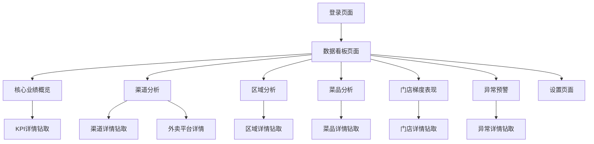

# 移动端老板报表数据看板产品需求文档

## 1. Product Overview

移动端H5老板报表数据看板是一个专为餐饮连锁企业管理者设计的实时数据监控平台，通过移动设备随时随地查看关键业务指标。

- 解决餐饮连锁企业管理者无法实时掌握全国门店经营状况的痛点，提供一站式数据监控和决策支持。
- 目标用户为餐饮连锁企业的高级管理者、区域经理和运营总监，帮助他们快速识别业务异常并做出及时决策。

## 2. Core Features

### 2.1 User Roles

| Role | Registration Method | Core Permissions |
|------|---------------------|------------------|
| 企业管理员 | 企业邮箱注册 + 管理员审核 | 查看所有数据、设置预警阈值、导出报表 |
| 区域经理 | 邀请码注册 | 查看负责区域数据、接收异常预警 |
| 门店经理 | 门店编码注册 | 查看本门店数据、对比同区域门店 |

### 2.2 Feature Module

我们的移动端老板报表数据看板包含以下主要页面：

1. **数据看板页面**：核心业绩概览、渠道分析、区域分析、菜品分析、门店梯度表现、异常预警六大板块
2. **登录页面**：用户身份验证和权限控制
3. **设置页面**：预警阈值配置、数据刷新频率设置
4. **渠道分析详情页**：展示堂食或外卖的详细数据分析
5. **外卖平台详情页**：按美团、饿了么、京东外卖维度展示营业额、订单数、客单价数据

### 2.3 Page Details

| Page Name | Module Name | Feature description |
|-----------|-------------|---------------------|
| 数据看板页面 | 核心业绩概览 | 展示在营门店数、总营业额、店均营业额的大型KPI卡片，包含日同比数据和趋势指示 |
| 数据看板页面 | 渠道分析 | 显示堂食外卖比例饼图、堂食客流量、客单价、外卖订单数等关键指标卡片，支持点击饼图跳转到对应详情页 |
| 数据看板页面 | 区域分析 | 支持钻取的各省份门店表现排名和同比数据 |
| 数据看板页面 | 菜品分析 | 展示TOP5单品和TOP3套餐的销量排行，支持钻取查看详情 |
| 数据看板页面 | 门店梯度表现 | 显示TOP10和末位10门店的营业额排名，支持钻取查看门店详情 |
| 数据看板页面 | 异常预警 | 实时监控营业额降幅、客流降幅、订单数降幅等异常指标，支持钻取查看具体门店 |
| 登录页面 | 用户认证 | 支持账号密码登录、记住登录状态、忘记密码找回 |
| 设置页面 | 参数配置 | 设置异常预警阈值、数据刷新频率、推送通知开关 |
| 渠道分析详情页 | 渠道详细数据 | 展示堂食或外卖的详细数据分析，包括趋势图、时段分布、门店排行列表，支持返回按钮 |
| 外卖平台详情页 | 平台维度分析 | 按美团、饿了么、京东外卖三个维度展示各平台的营业额、订单数、客单价数据，支持平台间对比分析 |

## 3. Core Process

**管理员操作流程：**
用户登录 → 查看核心业绩概览 → 检查异常预警 → 钻取查看具体问题门店 → 分析渠道和区域数据 → 点击渠道饼图查看详细分析 → 调整运营策略

**区域经理操作流程：**
用户登录 → 查看负责区域数据 → 对比门店表现 → 分析菜品销售情况 → 点击外卖饼图查看平台维度数据 → 处理异常预警 → 制定改进措施

## 4. User Interface Design

### 4.1 Design Style

- **主色调**：#FF6B35（橙色）作为主色，#1890FF（蓝色）作为辅助色
- **按钮样式**：圆角矩形按钮，8px圆角，带阴影效果
- **字体**：PingFang SC（苹果设备）/ Microsoft YaHei（安卓设备），标题16-20px，正文14px，数据18-24px
- **布局风格**：卡片式布局，顶部导航，垂直滚动，间距统一使用8px的倍数
- **图标风格**：线性图标，统一使用Ant Design图标库，支持趋势箭头和状态指示

### 4.2 Page Design Overview

| Page Name | Module Name | UI Elements |
|-----------|-------------|-------------|
| 数据看板页面 | 核心业绩概览 | 大型KPI卡片（白色背景，圆角12px，阴影），数值使用24px粗体，同比使用绿色/红色16px字体，带上下箭头图标 |
| 数据看板页面 | 渠道分析 | 饼图使用ECharts，橙蓝配色方案，支持点击饼图区域跳转到对应详情页，鼠标悬停显示手型光标 |
| 渠道分析详情页 | 渠道详细数据 | 页面顶部显示渠道类型标题，包含趋势图表、时段分布图、门店排行列表，支持返回按钮 |
| 外卖平台详情页 | 平台维度分析 | 顶部显示平台选择器（美团/饿了么/京东外卖），下方展示各平台数据对比卡片，包含营业额、订单数、客单价三个核心指标 |
| 数据看板页面 | 区域分析 | 列表式卡片，支持展开收起，排名使用数字徽章，同比数据右对齐显示 |
| 数据看板页面 | 菜品分析 | 横向滑动卡片，TOP标识使用金色徽章，销量数据突出显示 |
| 数据看板页面 | 门店梯度表现 | 双列表布局，TOP10使用绿色主题，末位10使用红色主题 |
| 数据看板页面 | 异常预警 | 红色警告卡片，带感叹号图标，异常数量使用红色徽章显示 |
| 登录页面 | 登录表单 | 简洁表单设计，输入框带图标，登录按钮使用主色调，背景使用渐变色 |
| 设置页面 | 配置选项 | 开关组件、滑块组件、选择器组件，分组显示不同类型设置 |

### 4.3 Responsiveness

产品采用移动端优先设计，主要适配375px-414px宽度的手机屏幕，支持竖屏和横屏切换。针对触摸交互进行优化，按钮最小点击区域44px，支持手势滑动和长按操作。卡片间距和字体大小根据屏幕尺寸自适应调整。
