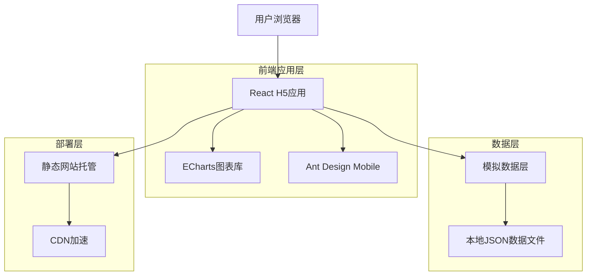

# 移动端老板报表数据看板技术架构文档

## 1. Architecture design



## 2. Technology Description

* Frontend: React\@18 + TypeScript\@5 + Vite\@5 + Ant Design Mobile\@5 + ECharts\@5 + TailwindCSS\@3

* 数据: 本地模拟数据 (Mock Data JSON文件)

* 状态管理: Zustand\@4

* 路由: React Router\@6

* 部署: 静态网站部署 (Vercel/Netlify/GitHub Pages)

## 3. Route definitions

| Route | Purpose |
|-------|---------|
| / | 数据看板主页，展示六大业务板块的核心指标 |
| /channel-analysis?type=dinein | 堂食渠道分析详情页 |
| /channel-analysis?type=takeout | 外卖渠道分析详情页 |
| /takeout-platforms | 外卖平台详情页，按美团、饿了么、京东外卖维度展示数据 |
| /region-analysis | 区域分析详情页，各省份门店表现钻取 |
| /region-analysis/:regionName | 指定区域详情页 |
| /product-analysis | 菜品分析详情页，TOP菜品和套餐详情 |
| /store-ranking | 门店梯度表现详情页，门店排名和对比 |
| /alert | 异常预警详情页，预警规则和异常门店列表 |
| /store/:storeId | 门店详情页 |
| /manage | 管理设置页面 |

## 4. 数据结构定义

### 4.1 模拟数据服务

数据通过本地JSON文件和模拟数据服务提供：

**数据获取方式**

```typescript
// 从本地JSON文件加载数据
import corePerformanceData from '@/data/corePerformance.json';
import channelAnalysisData from '@/data/channelAnalysis.json';
import alertRecordsData from '@/data/alertRecords.json';

// 模拟异步数据获取
const getCorePerformanceData = async (date: string) => {
  return new Promise((resolve) => {
    setTimeout(() => {
      const data = corePerformanceData.find(item => item.date === date);
      resolve(data);
    }, 300); // 模拟网络延迟
  });
};

// 获取外卖平台数据
const getTakeoutPlatformData = async (date: string) => {
  return new Promise((resolve) => {
    setTimeout(() => {
      const data = takeoutPlatformsData.find(item => item.date === date);
      resolve(data?.platforms || []);
    }, 300);
  });
};
```

### 4.2 TypeScript类型定义

```typescript
// 核心业绩数据类型
interface CorePerformance {
  id: string;
  date: string;
  active_stores: number;
  active_stores_change: number;
  total_revenue: number;
  total_revenue_change_rate: number;
  avg_store_revenue: number;
  avg_store_revenue_change_rate: number;
  created_at: string;
}

// 渠道分析数据类型
interface ChannelAnalysis {
  id: string;
  date: string;
  dine_in_ratio: number;
  takeout_ratio: number;
  dine_in_traffic: number;
  dine_in_traffic_change_rate: number;
  dine_in_avg_price: number;
  dine_in_avg_price_change: number;
  takeout_orders: number;
  takeout_orders_change_rate: number;
  takeout_avg_price: number;
  takeout_avg_price_change: number;
}

// 异常预警数据类型
interface AlertRecord {
  id: string;
  store_id: string;
  store_name: string;
  alert_type: 'revenue_drop' | 'traffic_drop' | 'order_drop' | 'takeout_ratio_high' | 'takeout_ratio_low';
  alert_value: number;
  threshold: number;
  is_active: boolean;
  created_at: string;
}

// 外卖平台数据类型
interface TakeoutPlatformData {
  platform_name: '美团' | '饿了么' | '京东外卖';
  turnover: number;
  orders: number;
  avg_price: number;
  turnover_change_rate: number;
  orders_change_rate: number;
  avg_price_change_rate: number;
  market_share: number;
}
```

## 5. 模拟数据文件结构

### 5.1 数据文件组织

```
src/
├── data/
│   ├── corePerformance.json      # 核心业绩数据
│   ├── channelAnalysis.json      # 渠道分析数据
│   ├── takeoutPlatforms.json     # 外卖平台数据（美团、饿了么、京东外卖）
│   ├── regionAnalysis.json       # 区域分析数据
│   ├── productSales.json         # 菜品销售数据
│   ├── storeRanking.json         # 门店排名数据
│   ├── alertRecords.json         # 异常预警数据
│   └── stores.json               # 门店基础信息
```

### 5.2 数据文件示例

**核心业绩数据 (corePerformance.json)**

```json
[
  {
    "date": "2024-01-15",
    "activeStores": 1250,
    "activeStoresChange": 8,
    "totalRevenue": 2850000,
    "totalRevenueChangeRate": 12.5,
    "avgStoreRevenue": 2280,
    "avgStoreRevenueChangeRate": 8.3
  }
]
```

**渠道分析数据 (channelAnalysis.json)**

```json
[
  {
    "date": "2024-01-15",
    "dineInRatio": 65.2,
    "takeoutRatio": 34.8,
    "dineInTraffic": 45680,
    "dineInTrafficChangeRate": 15.2,
    "dineInAvgPrice": 42.5,
    "dineInAvgPriceChange": 2.8,
    "takeoutOrders": 18950,
    "takeoutOrdersChangeRate": 22.1,
    "takeoutAvgPrice": 52.3,
    "takeoutAvgPriceChange": 3.2
  }
]
```

**异常预警数据 (alertRecords.json)**

```json
[
  {
    "id": "alert_001",
    "storeId": "store_001",
    "storeName": "北京朝阳店",
    "alertType": "revenue_drop",
    "alertValue": -52.3,
    "threshold": -50.0,
    "isActive": true,
    "createdAt": "2024-01-15T08:30:00Z"
  }
]
```

**外卖平台数据 (takeoutPlatforms.json)**

```json
[
  {
    "date": "2024-01-15",
    "platforms": [
      {
        "platform_name": "美团",
        "turnover": 285600,
        "orders": 1248,
        "avg_price": 228.8,
        "turnover_change_rate": 12.5,
        "orders_change_rate": 8.3,
        "avg_price_change_rate": 3.8,
        "market_share": 53.7
      },
      {
        "platform_name": "饿了么",
        "turnover": 156800,
        "orders": 742,
        "avg_price": 211.3,
        "turnover_change_rate": -2.1,
        "orders_change_rate": -1.5,
        "avg_price_change_rate": -0.6,
        "market_share": 29.5
      },
      {
        "platform_name": "京东外卖",
        "turnover": 89600,
        "orders": 385,
        "avg_price": 232.7,
        "turnover_change_rate": 25.8,
        "orders_change_rate": 18.2,
        "avg_price_change_rate": 6.4,
        "market_share": 16.8
      }
    ]
  }
]
```